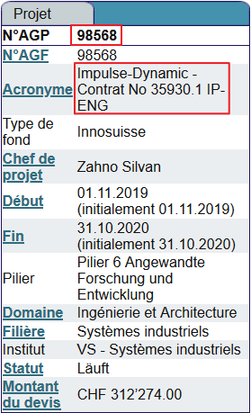
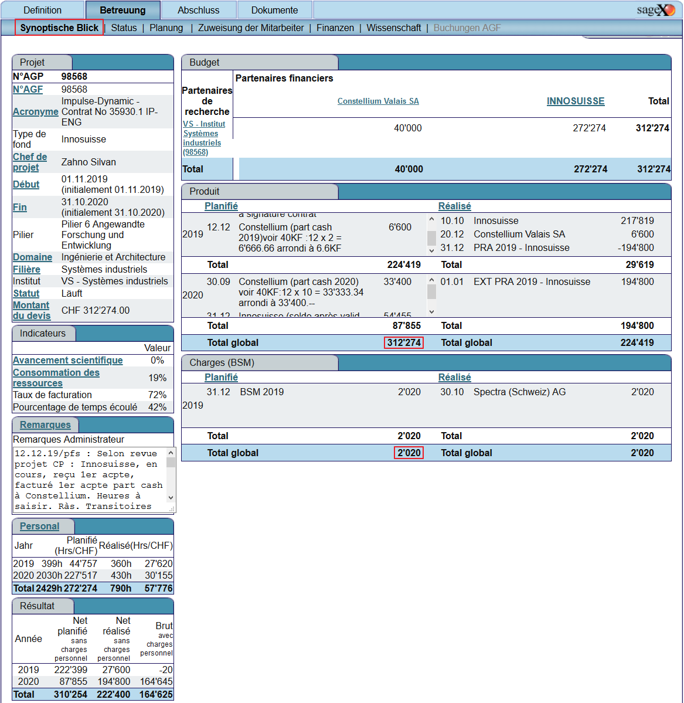
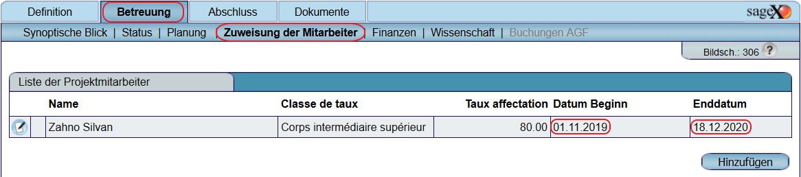

<h1 align="center">
  <br>
  
  <br>
  Dashboard for SageX Projects
  <br>
</h1>

```
         __ _____            __
  /\  /\/__\\_   \   /\   /\/ _\
 / /_/ /_\   / /\/___\ \ / /\ \  Dashboard
/ __  //__/\/ /_|_____\ V / _\ \ (c) zas, All rights reserved
\/ /_/\__/\____/       \_/  \__/
(c) - zas
```

# Table of contents
[Description](#description) •
[Project Structure](#project-structure) •
[Usage](#usage) •
[Git Comands](#git-commands) •
[Credits](#credits) •
[License](#license) •
[Find us on](#find-us-on)

## Description
This repository contains muliple python modules to be reused in project.

## Project Structure
```
  +-- hevslib/                    # hevslib submodule
  +-- img/                        # project images
  +-- in/                         # folder for input sageX Export files
  +-- out/                        # folder for generate report outputs
  +-- base_config.py              # dashboard project config
  +-- base_functions.py           # dashboard project specific functions
  +-- dashboard.ipynb             # main dashboard jupyter script
  +-- projectList.xls             # List of all project with their parameters
  +-- .gitignore
  +-- LICENSE                     # The project license
  +-- README.md                   # This file
```
## Usage

### Fill `projectList.xls`
Fill out the projectList.xls files the data can be found in sageX

* `project_number` & `title`
  
* `acronym` - project abbreviation (not from sageX)
* `title_humanreadable` - project title (not from sageX)
* `budget_total` & `budget_material`
  
* `date_begin` & `date_end`
  
* `update` - current date if you modify the project parameters

### Export the project data
For each project export the `ash_xxx.xls` rename it with `<project_number>.xls` and copy it to the `\in` folder


## Git Commands
### Clone
```sh
# Clone repo including submodules
git clone --recursive <repo_url>
```
### Pull changes repo and submodules
```sh
# Pull all changes in the repo including changes in the submodules (of given commit)
git pull --recurse-submodules
```

### Requirement
Requires the `python-hevslib` as submodule

## Credits
[(Back to top)](#table-of-contents)
* **Jerome Corre** - [Gitlab Profile](https://gitlab.hevs.ch/jerome.corre)
* **Silvan Zahno** - [Gitlab Profile](https://gitlab.hevs.ch/silvan.zahno) 

## License
[(Back to top)](#table-of-contents)

:copyright: [All rights reserved](LICENSE)

---

## Find us on
> [hevs.ch](https://www.hevs.ch) &nbsp;&middot;&nbsp;
> Facebook [@hessovalais](https://www.facebook.com/hessovalais) &nbsp;&middot;&nbsp;
> Instagram [@hessovalais](https://www.instagram.com/hessovalais/) &nbsp;&middot;&nbsp;
> Twitter [@hessovalais](https://twitter.com/hessovalais) &nbsp;&middot;&nbsp;
> LinkedIn [HES-SO Valais-Wallis](https://www.linkedin.com/groups/104343/) &nbsp;&middot;&nbsp;
> Youtube [HES-SO Valais-Wallis](https://www.youtube.com/user/HESSOVS)